## I. Definition

### Project Overview

In this project I discuss building a machine learning model to predict whether or not an applicant will default on their loan for the [Home Credit Default Risk](https://www.kaggle.com/c/home-credit-default-risk/data) competition running on Kaggle.com .  As part of the competition,Home Credit is providing historical data on actual clients and loans. 

### Background

The unbanked are adults without an account at a bank or other financial institution and are outside of the mainstream with respect to finances.  As a result, the unbanked pay excessive fees for basic financial services, are susceptible to high-cost predatory lenders, or have difficulties buying a home or otherwise acquiring asset [1](https://web.archive.org/web/20110102190942/http:/www.fdic.gov/consumers/community/unbanked/index.html).  According to the [World Bank](https://globalfindex.worldbank.org/chapters/unbanked) there are globally about 1.7 billion adults that are unbanked—without an account at a financial institution or through a mobile money provider. In 2014 the that number of unbanked was 2 billion. 

[Home Credit](https://www.homecreditus.com/) is an international consumer finance provider with operations in 10 countries that was founded in 1997. They strive to broaden financial inclusion for the unbanked population by providing a positive and safe borrowing experience. In order to make sure this underserved population has a positive loan experience, Home Credit makes use of a variety of alternative data (including telecommunication and transactional information) to predict their clients' repayment abilities.

### Problem Statement

Although Home Credit is currently using various statistical and machine learning methods to predict their client’s repayment abilities, they are hoping for a new model which can ensure that clients capable of repayment are not rejected, thereby empowering their clients to be successful.  They have partnered with kaggle.com to offer a competition to help them unlock the full potential of their data.  The challenge is to build a model to predict the risk level of a given loan.  

### Solution Statement

To be explicit the solution statement is to build a machine learning model that will predict the risk level of a loan by making a probability prediction between 0 and 1.  A score of 0 means a loan has no risk and will get repaid and a score of 1 means it is extremely risky and will not get repaid. 

To solve the solution statement and build a machine learning model that will predict the risk level of a loan I will use the following [5-step process](https://machinelearningmastery.com/machine-learning-with-python/): 

1.	Summarize Data:  In this step I will analyze the datasets to better understand the data made available by Home Credit. I will get a better understanding of the data by using descriptive statistics and data visualizations.

2.	Prepare Data: Here I will prepare the data in such a way that it exposes the structure of the problem and relationship between the input features and target variable.  This includes cleaning the data and handling missing values.  I will perform feature selections where redundant features may be removed and new features can be developed.  Additionally, I will perform data transformation to scale features for model input. 

3.	Evaluate Algorithms:  In this step I will choose some machine learning algorithms and compare their accuracy and skillfulness. Most importantly, I will be trying to find a subset of machine learning algorithms which are good at exploiting the structure in the data.
 
4.	Improve Results: Once I have identified a few good performing algorithms, I will try to optimize them to yield better results. To achieve optimization, I will use tuning to search for an optimal combination of parameters for each algorithm.  

5.	Present Results:  In this final step I will take the best performing model and make predictions and present them visually.  To finish, I will make a submission on kaggle.com to the Home Credit competition.

### Metrics

The competition evaluates a loan prediction model using the Receiver Operating Characteristic (ROC) curve.  The ROC curve is useful for predicting the probability of a binary outcome such as our case (loan default versus non-default).  The ROC curve plots the false positive rate (x-axis) versus the true positive rate (y-axis) for a number of different candidate threshold values between 0.0 and 1.0. One benefit of the ROC curves is that different models can be compared directly in general or for different thresholds using the area under the curve (AUC) measurement. A higher AUC score means a better model. 

## II. Analysis

### Datasets and Inputs

As part of the competition Home Credit is providing various datasets of actual client loans.   The 9 provided datasets are described below:

1.	application_train.csv: Client application training data where one row represents one loan. Every loan is uniquely identified by the `SK_ID_CURR` field. The dataset contains 122 fields, including the target variable (1 – loans with payment difficulties and 0 – loans without payment difficulties).  Other fields included in the dataset are gender, number of children and income.
 
2.	application_test.csv: Client application testing dataset includes all the same fields as the application_train.csv except the target variable.  This is the dataset that will be used to create a submission file for the competition.

3.	bureau.csv:  A client’s previous credit history provided by other financial institutions that were reported to a credit bureau.  The dataset contains 17 fields.  Every previous credit in this dataset is one row identified by the `SK_ID_BUREAU` field and every row is linked back to the application (train or test) dataset by the SK_ID_CURR field.

4.	bureau_balance.csv: Credit bureau monthly balances.  The file contains one row for each month where a client has data.  The file contains 3 fields.  Every row is linked to the bureau dataset by the by `SK_ID_BUREAU` field.

5.	POS_CASH_balance.csv: Monthly balance snapshots of previous point of sales (POS) and cash loans that the applicant had with Home Credit and linked back to the previous loan data by `SK_ID_PREV`.  The file contains 8 fields.

6.	credit_card_balance.csv: Monthly balance snapshots of previous credit cards that the applicant has had with Home Credit and is linked back to the previous loan dataset by the `SK_ID_PREV` field. The file contains one row for each month where a client had data.  The file contains 23 fields.

7.	previous_application.csv: This file has 38 fields and contains data on clients that have had previous loans with Home Credit.  Every previous application is unique by the `SK_ID_PREV` field. 

8.	installments_payments.csv: Repayment history for the previously issued credits by Home Credit related to the loans in the application sample (train and test dataset) and is linked back to the previous loan dataset by `SK_ID_PREV` field.

9.	HomeCredit_columns_description.csv: This file contains descriptions of the columns in the various dataset files.

### Data Exploration and Exploratory Visualization

I prepared 8 notebooks to better understand the datasets.  In these notebooks I used descriptive statistics and data visualizations to better understand the data made available by Home Credit.  Each notebook is divided into sections. 

Within each notebook I prepared a table by the datatype to get an understanding of each data field.  For example the table for the continuous (`float64`) types has following columns:
- row count (non-null)
- null row count
- null percentage
- mean
- standard deviation
- minimum value
- 25% percentile value
- 50% percentile value
- 75% percentile value
- maximum value

The table for integer (`int64`) and string (`object`)  types has the following columns:
- row count (non-null)
- null row count
- null percentage
- number of unique values
- the top value 
- the top value percent

Below I summarize the data exploration analysis from each notebook: 

#### Notebook - `01_applications_continuous_types.ipynb`: 

> In this notebook I analyze and summarize the `application train` and `application test` datasets' continuous or `float64` types.  To be more efficient I combined both datasets into one dataframe and added a filter to later separate them.  The datasets have 70 continuous datatypes.  In section 1.1, I prepared a table to summarize each continuous fields and the first 20 items in the table are shown below:

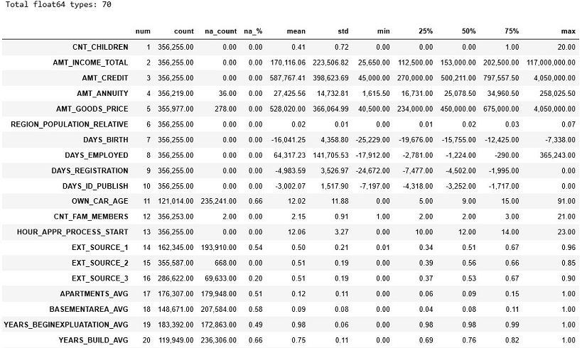

The first observation I noticed was that a lot of fields have missing values.  To analyze the missing values I prepared a [missingno correlation heatmap](https://github.com/ResidentMario/missingno) to measure nullity correlation or how strongly the presence or absence of one variable affects the presence of another.  Nullity correlation ranges from -1 (if one variable appears the other definitely does not) to 0 (variables appearing or not appearing have no effect on one another) to 1 (if one variable appears the other definitely also does).

In section 1.5 I prepared a correlation heatmap to visualize correlations between fields.

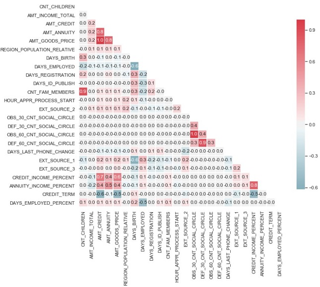

Some observations from the correlation heatmap are:
> - The fields `CNT_CHILDREN` and `CNT_FAM_MEMBERS` have a high correlation.
> - The fields `AMT_GOODS_PRICE` and `AMT_CREDIT` are perfectly correlated.
> - The fields `AMT_GOODS_PRICE` has a high correlation with `AMT_ANNUITY`.
> - The fields `AMT_ANNUITY` and `AMT_CREDIT` have a high correlation.
> - The fields `CNT_CHILDREN` and `CNT_FAM_MEMBERS` have a high correlation.
> - The fields `OBS_30_CNT_SOCIAL_CIRCLE` and `OBS_60_CNT_SOCIAL_CIRCLE` are perfectly correlated.
> - The fields `DEF_30_CNT_SOCIAL_CIRCLE` and `DEF_60_CNT_SOCIAL_CIRCLE` have a high correlation.

In section 1.7 I prepared histograms to visualize the distribution of the fields.  The first four histograms are shown below:

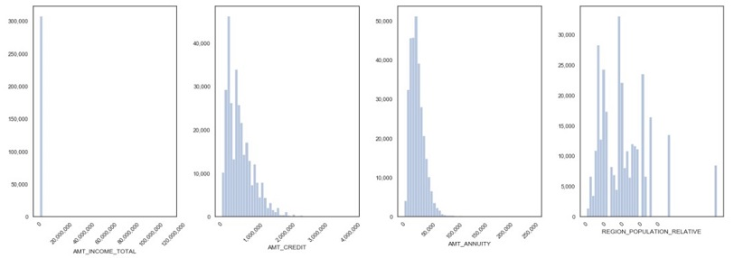

Some observations from reviewing the histograms:
> - Most fields have outliers and are not normally distributed.
> - Some fields such as `AMT_INCOME_TOTAL`, `AMT_CREDIT` and `AMT_ANNUITY` as are rightly skewed.

#### Notebook - `02_applications_integer_types.ipynb`:   

In this notebook I analyze and summarize the `application train` and `application test` datasets' integer or `int64` types.  To be more efficient I combined both datasets into one dataframe and added a filter to later separate them.  The datasets have 34 integer data types.  In section 2.1, I prepared a table to summarize each field and the first 20 items in the table are shown below:

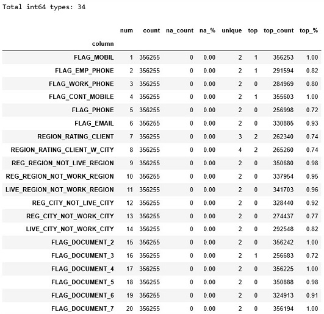

Based on analysis of the table, the key observation is that some of the fields are highly unbalanced where one value comprises a large percentage of the total. For example, the `FLAG_MOBIL` is one highly unbalanced field.  

#### Notebook - `03_applications_string_types.ipynb`:  

In this notebook I analyze and summarize the `application train` and `application test` datasets' string or `object` types.  To be more efficient I combined both datasets into one dataframe and added a filter to later separate them.  The datasets have 16 string datatypes.  In section 3.1 I prepared a table to summarize each fields as shown below:

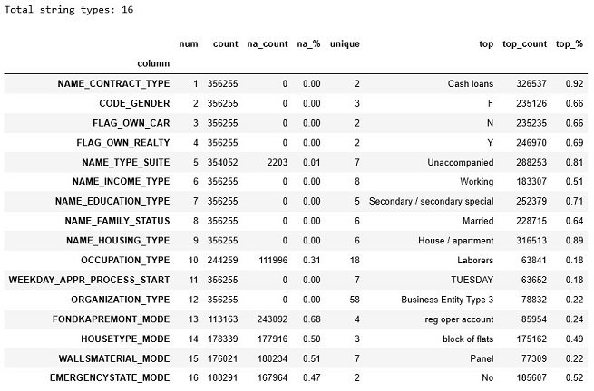

One observation is that a lot of the housing fields have missing values such as the FOUNDKAPREMONT_MODE and HOUSTYPE_MODE fields. 

#### Notebook - `04_bureau_data_analysis.ipynb`: 

In this notebook I analyzed the `bureau` dataset.  The dataset has 14 continuous and 3 string fields as shown below:

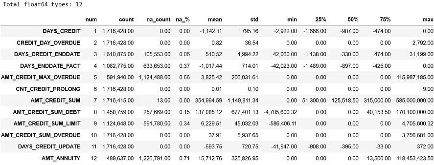

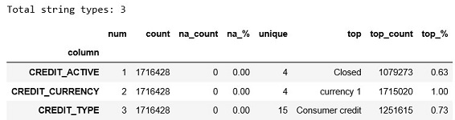

One observation is that the string types fields are highly unbalanced where one makes up the majority of the total as shown below:

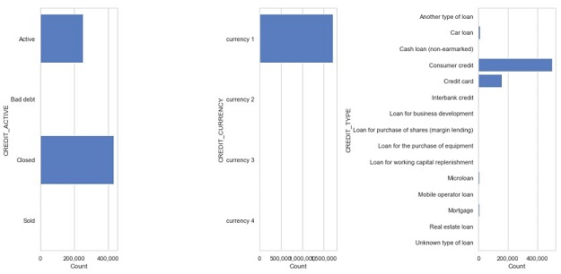

#### Notebook - `05_pos_balances.ipynb`: 

In this notebook I analyzed the `pos balances` dataset.  The dataset has 5 continuous and 1 string fields as shown below:

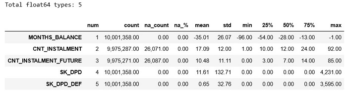

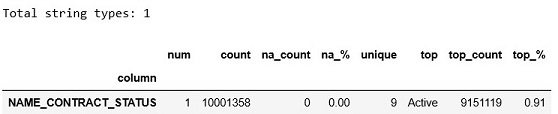

This dataset has over 10 million records and does not have many missing values.

#### Notebook - `06_credit_card_balance.ipynb`: 

In this notebook I analyzed the `credit card balance` dataset.  The dataset has 20 continuous and 1 string fields as shown below:

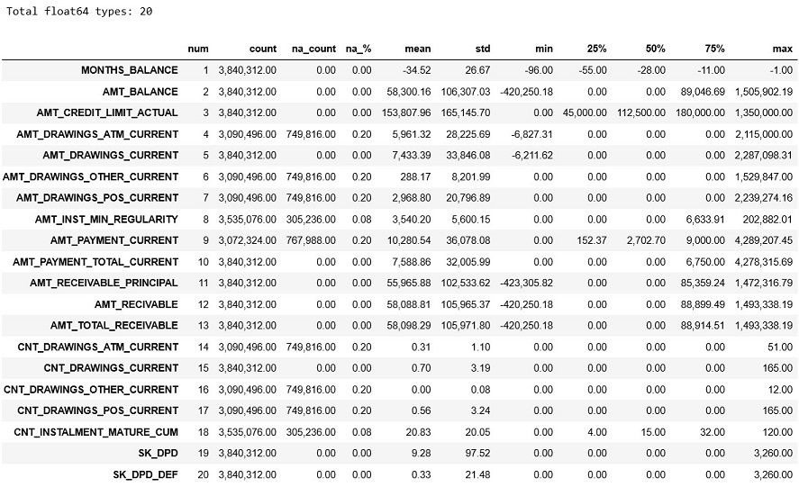

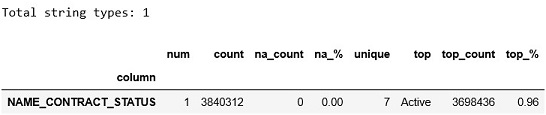

The dataset has over 3 million records and does not have many missing values.

#### Notebook - `07_previous_appliation.ipynb`: 

In this notebook I analyzed the `previous application` dataset.  The dataset has 15 continuous, 4 integer and 16 string fields as shown below:

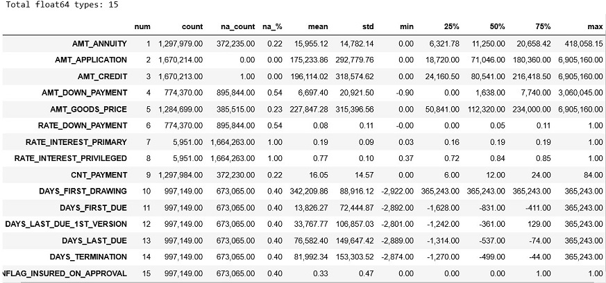

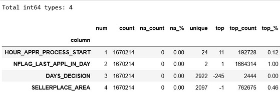

Some of the fields such as the `RATE_INTEREST_PRIMARY` and `RATE_INTEREST_PRIVILEGED` have a high missing value rate.

#### Notebook - `08_installment_payments.ipynb`: 

In this notebook I analyzed the `installment payment` dataset.  The dataset has 6 continuous fields as shown below:

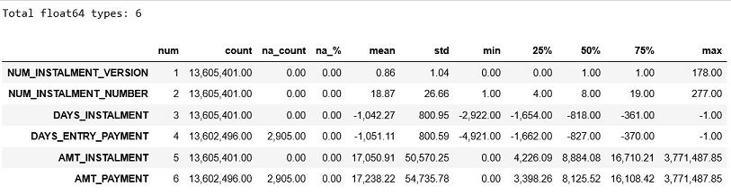

The dataset has over 13.5 million records and does not have many missing values.

### Algorithms and Techniques

To find a solution to our problem I will perform the following tasks:
>  1. Select and evaluate the performance of different classifier algorithms with KFold cross-validation:  [Cross-validation](https://machinelearningmastery.com/k-fold-cross-validation/) is a resampling procedure used to evaluate machine learning on unseen data.  It works by splitting the dataset into k-parts (e.g. k = 5 or k = 10). Each split of the data is called a fold. The algorithm is trained on k−1 folds with one held back and tested on the held back fold. This is repeated so that each fold of the dataset is given a chance to be the held back test set. After running cross-validation you end up with k different performance scores that you can summarize using a mean and a standard deviation.   
>  2. Feature importance analysis: After selecting an algorithm I will perform a feature importance analysis to remove features that are not adding any values.  Eliminating features that add zero value
    can improve model performance and training time. Feature importance provides a score that indicates how useful or valuable a feature is within the model.
>  3. Performed a grid search: A grid search is an approach to parameter tuning that will iteratively build and evaluate a model for each combination of algorithm parameters in the grid. At the end the grid search provides the best combination of parameters.
>  4. Final model train and testing: This involves training the tuned final model using a training and testing set.
>  5. Prepare competition submission file:  Here I will use the testing dataset to make a prediction using the final model and then submit it to the [Home Credit Default Risk](https://www.kaggle.com/c/home-credit-default-risk/data) competition.

The task in this project is to solve a classification problem.  It is a classification task because the target feature is binary (0 for non-default and 1 for default).  For step 1 discussed above, I selected to evaluate various classifier algorithms.  The algorithms are described below:

> 1. [Logistic Regression Classifier](https://scikit-learn.org/stable/modules/generated/sklearn.linear_model.LogisticRegression.html): 
>> Used for binary classification problems with two class values (binary values). It is used to explain the relationship between one dependent binary variable and one or more independent variables.  
>  2. [Gradient Boosting Classifier](https://en.wikipedia.org/wiki/Gradient_boosting):
>> A machine learning ensemble method that produces a strong model by combining weak models. It is used on both classifications and regression problems. I will test three different implementations of Gradient Boosting([LGBM](https://lightgbm.readthedocs.io/en/latest/Python-API.html), [sklearn](https://scikit-learn.org/stable/modules/generated/sklearn.ensemble.GradientBoostingClassifier.html) and [XGBoost](https://xgboost.readthedocs.io/en/latest/)).
>  3. [Linear Discriminant Analysis (LDA)](https://scikit-learn.org/stable/modules/generated/sklearn.discriminant_analysis.LinearDiscriminantAnalysis.html): 
>> A classifier with a linear decision boundary, generated by fitting class conditional densities to the data and using Bayes’ rule.
>  4. [Gaussian Naive Bayes (NB)](https://scikit-learn.org/stable/modules/generated/sklearn.naive_bayes.GaussianNB.html):
>> An implementation of the Gaussian Naive Bayes algorithm for classification where the likelihood of the features is assumed to be Gaussian.
>  5. Two layer [Neural Network](https://en.wikipedia.org/wiki/Artificial_neural_network) implemented in [keras](https://keras.io/):
>> A neural network is a type of algorithm which models itself after the human brain. A neural network algorithm automates the process of learning patterns from data to then make predictions on new data[1](https://www.techradar.com/news/what-is-a-neural-network).

The results of these algorithms will be compared with the Naive Predictor bench mark algorithm.  I will discuss the input parameters for the final selected model in a later section.  

### Benchmark Model 

To measure model performance I will use two benchmarks:

> 1. A naive base model predictor that will always predict that a loan is not risky (prediction 0).  I will use the naive predictor model during the model evaluation phase to show what a model without any intelligence would look like. 
> 
> 2. The Home Credit competition on kaggle.com.  By submitting to the competition, I can measure my best performing model against thousands of other models. 

## III. Methodology

### Data Preprocessing

As I mentioned above I prepared 8 notebooks to better understand the datasets.  In these notebooks I used descriptive statistics and data visualizations to better understand the data made available by Home Credit.  In these notebooks I also pre-processed the datasets in such a way that it exposed the structure of the problem and relationship between the input features and target variable.  In general I performed the following data preparation tasks within these notebooks:
-	Cleaned the data by handling missing values either by removing fields or filling in the missing value.  
-	Performed feature selection where highly unbalanced or highly correlated fields were removed.
-   Transformed some of the fields to make their distribution more normal.
-   Performed feature engineering to create new features from existing ones. 
-   Saved a new pre-processed dataset with the final selected and derived features.

In addition to these 8 notebooks I prepare two other notebooks called `09_pre_process_aggregation.ipynb` and `10_stratified_dataset.ipynb` where 
I further processed the new pre-processed dataset for model input.

The main goal with pre-processing and feature engineering is to get the most out of the data for algorithm input.  
[Feature engineering](https://machinelearningmastery.com/discover-feature-engineering-how-to-engineer-features-and-how-to-get-good-at-it/) is defined as the process of transforming raw data into features that better represent the underlying problem to the predictive models, resulting in improved model accuracy on unseen data.

Below I discuss the pre-processing I performed in each notebook:

#### Notebook - `01_applications_continuous_types.ipynb`: 

In this notebook I analyzed and pre-processed the `application train` and `application test` datasets' continuous or `float64` types.  To be more efficient I combined both datasets into one dataframe and added a filter to later separate them.  The datasets have 70 continuous datatypes.   Below I discuss the pre-processing task I performed for these datasets.

I remove any fields that had missing values percentage higher than 10% with exception of the `EXT_SOURCE_1` and `EXT_SOURCE_3`. The `EXT_SOURCE_1` and `EXT_SOURCE_3` are domain knowledge fields as I learned from competition discussion boards.  I filled the fields with a missing percentage less than 10% with median value from the __TRAINING__ dataset.
I filled in the missing values for the `EXT_SOURCE_1` and `EXT_SOURCE_3` fields using prediction. I predicted the value of `EXT_SOURCE_1` and `EXT_SOURCE_3` with 7 of the other features using a gradient boosting model (See section 1.8).

After the correlation analysis (section 1.5) I removed `AMT_GOODS_PRICE`, `CNT_CHILDREN`, `OBS_30_CNT_SOCIAL_CIRCLE` and `DEF_30_CNT_SOCIAL_CIRCLE` as feature fields because they are highly correlated with other fields and thus will provide minimal value to our model.

After the histogram analysis I performed the following tasks:
> - Applied log and boxcox transformations to some of the fields to reduce skewness and get some more normality from the distribution of the data.
> - Removed outliers using [Tukey's Method](https://en.wikipedia.org/wiki/Outlier#Tukey's_fences) on some fields.
> - Converted the fields `CNT_FAM_MEMBERS`,`DEF_60_CNT_SOCIAL_CIRCLE` and `OBS_60_CNT_SOCIAL_CIRCLE` to categorical fields.

Below is a histogram of some of the fields that were logged transformed and where outliers were removed:

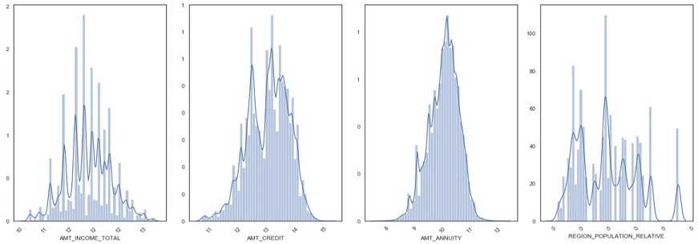

After analyzing the 70 continuous fields, 20 (including derived features) were selected as features.

#### Notebook - `02_applications_integer_types.ipynb`:

In this notebook I analyzed and pre-processed the `application train` and `application test` datasets' integer or `int64` types.  To be more efficient I combined both datasets into one dataframe and added a filter to later separate them.  The datasets have 34 integer data types.   Below I discuss the pre-processing tasks I performed for these datasets.   

As mentioned above in the data exploration section many of the fields are highly unbalanced where one value makes up a large percentage of the total.  In the end I decided to select only fields where the top value constitutes less than 97% of the total resulting in 14 fields selected as feature fields from the 34 available.

#### Notebook - `03_applications_string_types.ipynb`:   

In this notebook I analyze and pre-processed the `application train` and `application test` datasets' string or `object` types.  To be more efficient I combined both datasets into one dataframe and added a filter to later separate them.  The datasets have 16 string data types.   Below I discuss the pre-processing task I performed for these datasets.

After analyzing the string type fields I decided to remove the fields that had a null or missing rate greater than 10%.  For the fields that had a null rate less than 10% I filled in the missing values with the most frequent value.  My analysis began with 16 string type fields and at the end I was left with 11.  These 11 fields will be treated as categorical features.

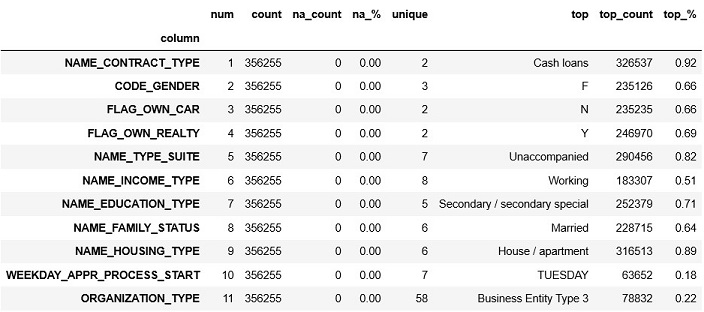

#### Notebook - `04_bureau_data_analysis.ipynb`: 

In this notebook I analyzed and pre-processed the `bureau` the dataset.  The dataset has 14 continuous and 3 string fields. Below I discuss the pre-processing task I performed for this dataset.

After analyzing the `bureau` dataset I created 57 features.  Most of the features were created using featuring engineering where I created an aggregate dataset of four functions ('minimum', 'maximum', 'mean', 'standard deviation') by `SK_ID_CURR` for each of the available `float64` fields.  Each field would have a new column for each of the functions.  This created a total of 48 features.  I also created 9 features using domain knowledge and they are described below:
> - COUNT_GROUP: The number of accounts by bin size of 5 (i.e. 1 means 0 to 5 accounts).
> - OVERDUE: Flag to indicate if a client has an overdue account.
> - DEBT_OVER_50%: Account group with credit limit 50% or higher.
> - DEBT_OVER_75%: Account group with credit limit higher 75% or higher.
> - DEBT_OVER_100%: Account group with credit limit higher 100% or higher.
> - ACTIVE: The number of active accounts by id group by bin size of 5. 
> - CLOSED: The number of closed accounts by id group by bin size of 5. 
> - ADVERSE: The number of adverse (bad debt or sold) accounts by id group by bin size of 5. 
> - CREDIT_TYPE_COUNT: The number of different types accounts by id group. 

#### Notebook - `05_pos_balances.ipynb`: 

In this notebook I analyzed and pre-processed the `pos balance` dataset.  The dataset has 5 continuous and 1 string fields. Below I discuss the pre-processing task I performed for this dataset.

After analyzing the `pos balances` dataset I created 57 features.  Most of the features were created using feature engineering where I created an aggregate table of four functions ('minimum', 'maximum', 'mean', 'standard deviation') by `SK_ID_CURR` for each of the available `float64` fields.  Each field would have a new column for each of the functions.  This created a total of 20 features.  An additional 2 features were created and described below:
> - COMPLETED_COUNT: The number of completed accounts by bin size of 5( i.e. 1 means 0 to 5 accounts).
> - OVERDUE_ACTIVE_COUNT: Flag to indicate if a client has an overdue account.

#### Notebook - `06_credit_card_balance.ipynb`: 

In this notebook I analyzed and pre-processed the `credit card balance` dataset.  The dataset has 20 continuous and 1 string fields. Below I discuss the pre-processing task I performed for this dataset.

After analyzing the `credit card balance` dataset I created an aggregate table of four functions ('minimum', 'maximum', 'mean', 'standard deviation') `SK_ID_CURR` for each of the available `float64` fields.  Each field would have a new column for each of the functions.  This created a total of 80 feature engineering fields.  

#### Notebook - `07_previous_appliation.ipynb`: 

In this notebook I analyzed and pre-processed the `credit card balance` dataset.  The dataset has 20 continuous and 1 string fields. Below I discuss the pre-processing task I performed for this dataset.

I created aggregated features for the `AMT_ANNUITY`, `AMT_APPLICATION` and `AMT_CREDIT` fields of four functions ('minimum', 'maximum', 'mean', 'standard deviation') by the `SK_ID_CURR` id field.  This resulted in 12 aggregated feature fields. I created additional features (in section 7.4) by pivoting certain columns by each unique category within the column and then counting the categories by the `SK_ID_CURR` id field.  For example the `NAME_CONTRACT_STATUS` field has four unique values, I created a column for each and counted the occurrence by the `SK_ID_CURR` id field.  This resulted in 23 additional feature fields.

#### Notebook - `08_installment_payments.ipynb`: 

In this notebook I analyzed and pre-processed the `installment payment` dataset.  The dataset has 6 continuous fields. Below I discuss the pre-processing task I performed for this dataset.

After analyzing the `installment payments` dataset I created a category feature called `PAYMENT_GRADE` and a historical on-time payment measure column called `TIMELY_PERCENT`.  The `PAYMENT_GRADE` column puts every installment client into a category based on their on-time historical payment percentage measure by their `TIMELY_PERCENT` column.  Below are the 5 categories for the `PAYMENT_GRADE`:

> - Good: 89% and above
> - Par: 83% to 89%
> - Subpar: 71% to 83%
> - Poor: 53% to 71%
> - Very Poor: Less than 53%

#### Notebook - `09_pre_process_aggregation.ipynb`:

In the 8 notebooks discussed above I pre-processed the various datasets and then created a new dataset for each that was saved to file.  This created a total of 8 files. In this notebook, I combined the new 8 pre-processed dataset files and saved them under one file. The new combined file contains both the training and testing datasets.

#### Notebook -`10_stratified_dataset.ipynb`:

As shown below the training dataset is highly unbalanced where the default class (target value 1) makes up around 8% of the total.

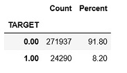

I created a stratified under-sampled dataset for the training dataset. I applied under-sampling so that the target class (0-non-defaults and 1-defaults) can be represented more equally.  I decided to use under-sampling versus over-sampling because I have a large dataset.  To perform the under-sampling I used sklearn's [StratifiedShuffleSplit](https://scikit-learn.org/stable/modules/generated/sklearn.model_selection.StratifiedShuffleSplit.html) API. The `AMT_ANNUITY` field was used to create a category field that served as the stratifying class.  In the new under-sampled dataset the default class make up 49.8% of the total as shown below:

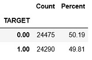

Finally, I normalized all the continuous fields and one-hot encoded all the categorical features. I also separated the final combined pre-processed training and testing datasets.  The final normalized training set had 48,765 records and 283 column (including the `SK_ID_CURR` id field and `TARGET` field).  The final normalized testing set had 48,744 records and 282 columns (including the `SK_ID_CURR` id field).  The testing dataset does not a have `TARGET` field because we will use it to make a submission file for the [Home Credit Default Risk](https://www.kaggle.com/c/home-credit-default-risk/data) competition.

### Implementation and Refinement

To implement a solution to this problem I prepared a notebook called `11_model_selection.ipjnb`.  Which is divided into 7 sections discussed below.

> 11.1 - Import Normalized Dataset: This is where I imported the normalized stratified training dataset that was created in the notebook `10_stratified_dataset.ipynb`.  

> 11.2 - Evaluate Models Performance: Here is where I evaluated the various algorithms using kFold cross validation.  I defined a `NaivePredictor` class that served as a benchmark algorithm.  To evaluate the algorithms I defined a function called `def evaluate_models(models,X_,y_,fold_split=10)` which evaluated each given algorithm and calculated its AUC score.  The results of the evaluation are shown below:

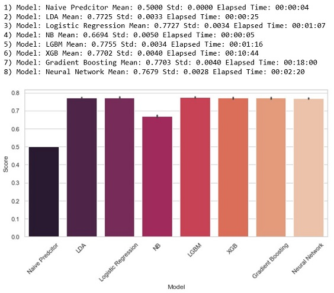

> As the above graph shows the best performing model was the Gradient Boosting Model implemented in the [LightGBM](https://lightgbm.readthedocs.io/en/latest/index.html#) API.  LightGBM uses tree based learning algorithms. It is designed to be distributed and efficient. I chose the LightGBM as the final model because it achieved the highest average score and also had one of the lowest training times.   

> As expected the naive predictor benchmark model was the worst performer.  Considering that our training set is equally weighted between defaults and non-defaults, I was expecting an AUC score of 0.50 and that is exactly what it scored.

> 11.3 Feature Importance:  I performed a feature importance analysis to determine which are the most relevant features and to eliminate any features with a feature importance score of zero. After the analysis I eliminated 63 features that had a feature importance of zero.  I used the LightGBM algorithm to calculate the scores, the top features are listed below:

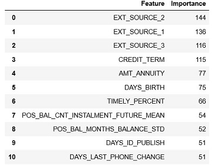

> 11.4 Create Training and Testing Dataset: The training dataset is split into a training and testing subset.

> 11.5 Model Tuning: In this section I performed model tuning on the LightGBM model to find the optimal parameters.  
Based on the recommendation from the [API documents](https://lightgbm.readthedocs.io/en/latest/Parameters-Tuning.html) I performed a grid search on following parameters:
>> - `num_leaves` - (int, optional (default=31)) – Maximum tree leaves for base learners.
>> - `max_depth` - (int, optional (default=-1)) – Maximum tree depth for base learners, -1 means no limit.
>> - `learning_rate` - (float, optional (default=0.1)) – Boosting learning rate.
>> - `n_estimators` - (int, optional (default=100)) – Number of boosted trees to fit.

>> The grid search returned the following as the optimal parameters:  `num_leaves`: 25, `max_depth`: 20, `learning_rate`: 0.1 and `n_estimators`: 100.

## IV. Results

### Model Evaluation and Validation

In sections 11.6 in the notebook `11_model_selection.ipjnb` I trained the final model with the optimal parameters obtained from the grid search in 11.5.  The final model achieved an AUC score on of 0.7816 on the testing dataset.  The ROC curves for the final and bench mark models are plotted below.  

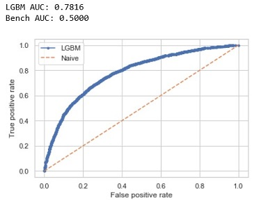

The ROC curve is useful because the curves of different models can be compared directly in general or for different thresholds. The shape of the curve tells about the expected false positive rate, and the false negative rate.  
The curve for the LGBM is more skillful because it assigns a higher probability to a randomly chosen real positive occurrence than a negative occurrence on average.  Generally, skillful models are represented by curves that bow up to the top left of the plot.  As the graph illustrates the benchmark model has no skill.

In section 11.7 I prepared a submission file with the final train model and made a submission to [Home Credit Default Risk](https://www.kaggle.com/c/home-credit-default-risk/data) competition.   By submitting to the competition, I can measure my best performing model against thousands of other models.
My model achieved an AUC score of 0.77090 on the private leader board and 0.77581 on the public leaderboard.  The difference between the leader boards is that the private leaderboard is calculated with only 80% of the test data.  

